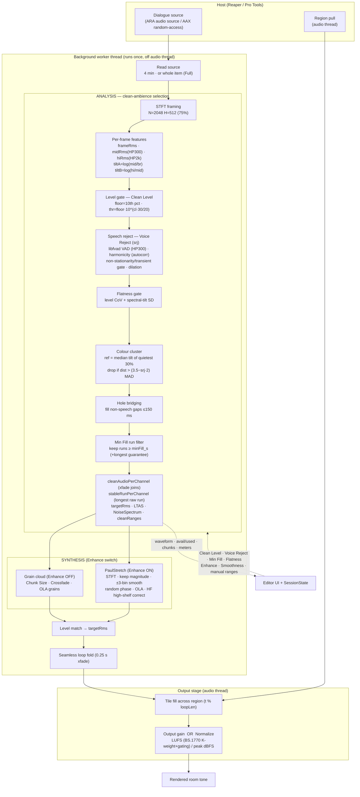

# ToneFill — Technical Specification

ToneFill is a **dialogue room-tone / ambience fill generator**. Given a production-dialogue
recording, it identifies the most spectrally and dynamically stable stretches of background
ambience, characterises them, and resynthesises arbitrarily long, seamless room tone matched to
the source.

- **Shared engine** (`tonefill_engine`, C++17) — host-agnostic analysis, synthesis and DSP.
- **JUCE client** (VST3 / AU) with **ARA** integration for Reaper. Rendering follows ARA's *pull*
  model: the host pulls audio from `ARAPlaybackRenderer`.
- **Native AAX client** (Pro Tools AudioSuite) built on `AAX_CHostProcessor` (random-access,
  `GetAudio` / `PreRender` / `RenderAudio` / `PostRender`), reusing the same engine. Currently loads
  and is PACE-signed; full render path paused.

---

## Signal flow

---

## 1. Host integration and threading (ARA)

- Analysis and rendering run **once, on a background thread** (`FillWorker : juce::Thread`), never
  on the audio thread. The worker reads the source via `ARAAudioSourceReader` (first 4 min by
  default; whole item — up to 15 min — in **Full** mode).
- `processBlock` on the audio thread only **tiles** the pre-computed fill across the region with a
  lock-free read and a seamless wrap.
- **Per-instance `SessionState`** (`shared_ptr`) bridges UI ↔ worker: render parameters and manual
  selection in; analysis status, meters, waveform and export buffer out. It is deliberately **not**
  a process-global singleton — Reaper instantiates one plugin per item, and a shared global
  previously caused instances to clobber each other's model/waveform/status.
- The learned description is an **immutable** `shared_ptr<const AmbienceModel>`, swapped atomically
  between threads; invalidated only by target / learn-region / analysis-parameter changes, not by
  render-only parameter tweaks.

## 2. Analysis pipeline — clean-ambience selection (core)

Input is decoded to mono/stereo (L/R correlation detects dual-mono). STFT framing: **N = 2048,
H = 512** (75 % overlap) at the analysis sample rate.

### 2.1 Per-frame features
- `frameRms` (broadband), `midRms` (IIR high-pass @ 300 Hz), `hiRms` (IIR high-pass @ 2 kHz), taken
  as the max across channels.
- Spectral tilt descriptors: `tiltA = log(midRms/frameRms)`, `tiltB = log(hiRms/midRms)` — a cheap
  two-dimensional timbre proxy avoiding a full per-frame FFT for the colour model.

### 2.2 Level gate (Clean Level)
- Noise floor = 10th percentile of `frameRms`. Threshold = `floor · 10^(cleanLevel·30/20)`, i.e.
  **0…30 dB above the floor**; analogous mid-band threshold. Higher Clean Level = more permissive.

### 2.3 Speech rejection (Voice Reject, `srj`) — four detectors
- **VAD (libfvad, BSD)** run on the **HP-300 Hz** signal (improves speech SNR in noisy beds).
  `vadMode = round((1−srj)·3)` ∈ {0…3} (higher `srj` ⇒ mode 0 ⇒ most aggressive). A frame is voiced
  if more than `1/(2 + srj·6)` of its sub-windows are flagged.
- **Harmonicity** (catches sustained vowels the VAD misses): decimated autocorrelation (factor 4)
  over the speech band, pitch search 80–400 Hz; threshold `0.62 − srj·0.30`. Safeguard: if >40 % of
  frames are harmonic (a steady tonal bed such as engine hum), the harmonic gate self-disables —
  that is ambience, not voice.
- **Non-stationarity / transient gate** (breaths, plosives, clicks, unvoiced fricatives): compares a
  frame's `midRms` to a local ~1 s running minimum; rejects if it exceeds
  `localMin · (1.25 + (1−srj)·2.5)`. Captures aperiodic, non-voiced events invisible to the two
  detectors above.
- **Dilation**: the speech mask is dilated by `round(srj·3)` frames to remove voice onsets/tails.

### 2.4 Stationarity gate (Flatness)
- Local window ±0.4 s. A frame is rejected if the **level coefficient of variation** exceeds
  `0.02 + (1−flatness)·0.6`, **or** the **local SD of spectral tilt** (`tiltA + tiltB`) exceeds
  `0.15 + (1−flatness)·0.9`. Enforces both amplitude and spectral steadiness.

### 2.5 Spectral-consistency clustering (colour anchor)
- Reference "dominant colour" = median tilt (`tiltA`, `tiltB`) over the **quietest ~30 % of
  frames**. This reference is **independent of Clean Level, Voice Reject and Flatness** — a critical
  design point: earlier versions derived the reference from the gated (`!speech`) set, so those
  knobs shifted the colour centroid and re-classified frames non-monotonically (knobs appeared to
  work backwards).
- Frames whose tilt distance from the reference exceeds `(3.5 − srj·2)` MAD units are dropped as
  off-colour.

### 2.6 Post-selection → fragments
- **Hole bridging**: non-speech gaps ≤ 150 ms between clean frames are filled, so transient-gate
  flicker doesn't shred a coherent bed into fragments. Speech is never bridged.
- **Min Fill** is a **direct minimum-run-length floor**: keep every contiguous clean run ≥
  `minFill_s`. Strictly monotonic (lower ⇒ more, shorter fragments; higher ⇒ fewer, longer), with a
  guarantee of at least the single longest run so output never collapses to silence.
- Kept runs are concatenated with **20 ms equal-power crossfades** → `cleanAudioPerChannel`.
- The **single longest raw run** (no joins) is extracted separately → `stableRunPerChannel`,
  consumed by PaulStretch.
- Diagnostics surfaced to the UI: `availableCleanSeconds` (total clean before Min Fill) vs
  `learnMaterialSeconds` (after) and chunk count, plus `speechContaminationHigh` / `loopRiskHigh`.

### 2.7 Profile products
- `targetRms` (room level), long-term average spectrum (LTAS), and a robust stationary
  `NoiseSpectrum` (per-bin magnitude over the 10–70th percentile band; computed but not yet used by
  the renderer).
- **Manual** mode bypasses the level gate (trusts the user's selection) while retaining Voice
  Reject, Flatness and Min Fill. **Full** analyses the entire item.

## 3. Synthesis

Two engines, switched by **Enhance**:

### 3.1 Grain cloud (Enhance OFF) — from `cleanAudioPerChannel`
- Grain length from **Chunk Size** (200–3000 ms), clamped to ≤ `srcLen/4`. Overlap density from
  **Crossfade** (2–8 simultaneous grains), clamped to the available slot count. Hann-windowed grains
  drawn from randomised source positions with anti-repeat and occasional reversal, overlap-added.
  Clamps prevent comb-filtering when source material is short.

### 3.2 PaulStretch resynthesis (Enhance ON) — from `stableRunPerChannel`
Public-domain algorithm (Nasca Octavian Paul), original implementation, over the single longest run
so the slow pass **never crosses a chunk boundary** (boundaries were the source of recurring
hiss/whoosh).
- `W = pow2(windowSize)`, `windowSize = (0.05 + smoothness·0.45)·sr` (50–500 ms). Synthesis hop =
  **W/4** (75 % overlap). Window `(1 − (2t − 1)²)^1.25`.
- Per frame: window → FFT → keep **magnitude**, **smooth across frequency (±3 bins)**, assign
  **randomised phase** (DC/Nyquist kept real) → IFFT → window → overlap-add. The analysis pointer
  advances slowly through the source once (`inStep = srcLen/numFrames`) with a **seed-derived start
  offset** (Regenerate = a new random realisation). Independent per-channel phase preserves stereo
  decorrelation/width.
- **HF correction**: measures the >3 kHz-to-broadband energy ratio of source vs output and applies a
  matching **high-shelf cut** (to −18 dB max) to remove resynthesis hiss without dulling genuine
  tone.

### 3.3 Level match
- Output normalised to `targetRms` with a shared L/R gain.

## 4. Output stage
- **Looping**: renders `loopLen + 0.25 s`, then performs a seamless fold (crossfading the tail into
  the head). ⚠️ **Known coupling**: `loopLen = 15 + smoothness·45 s` — loop length is unintentionally
  tied to Smoothness (a leftover from the former "Variation" control) and should be decoupled.
- Tiled across the ARA region (`t % loopLen`).
- **Output** stage is either a linear **Output gain** or a bake-in **Normalize**:
  - **LUFS (ITU-R BS.1770)** — K-weighting (high-shelf + RLB high-pass, coefficients derived for
    arbitrary sample rate), 400 ms block gating with −70 / −10 LU relative gates; true-peak held
    below −1 dBFS.
  - or **peak dBFS**.

## 5. UI and diagnostics
- Controls: Clean Level, Voice Reject, Min Fill, Flatness, Chunk Size, Crossfade, Smoothness,
  Output, Export Len; Enhance toggle; Auto/Manual; Full.
- Manual region selection on the waveform (inline + a resizable window with H/V zoom, scroll, SMPTE
  ruler), synchronised through `SessionState.manualRanges` with a generation counter that triggers
  re-analysis.
- Status readout: `used X s (N chunks) · avail Y s · in Z dB`, plus a down-sampled waveform with a
  per-bin clean/rejected overlay.

## 6. Candidate improvements

1. **Selection is a hand-tuned multi-gate heuristic.** Prime candidate for a statistical/learned
   model — e.g. a GMM over per-frame features, or an RNNoise-class speech/non-speech classifier —
   replacing the stacked gates.
2. **Flatness uses a coarse 3-band tilt** rather than true **spectral flux**. Raw-noise flux has too
   much frame-to-frame jitter; flux on a **smoothed spectrogram** (or a Mel/Bark-band representation)
   would be more discriminating.
3. **Colour clustering is 2-D (tilt only).** MFCCs or full spectral-envelope features would separate
   near-colour contaminants more reliably.
4. **PaulStretch draws on a single run** and loses variety when that run is short. Options:
   interpolate magnitude spectra across multiple runs, or cross-synthesise several beds.
5. **No true spectral-envelope matching** of output to source — only the HF high-shelf. The
   already-computed `NoiseSpectrum` could drive full-band envelope matching, or replace concatenation
   with pure spectral resynthesis for the bed.
6. **`loopLen` coupled to Smoothness** — decouple.
7. **No in-plugin audition** in Manual mode; **AAX/AudioSuite render path incomplete**.
8. **Loudness normalisation is computed on the loop**, not on the final export of the chosen length —
   a minor consistency gap.
